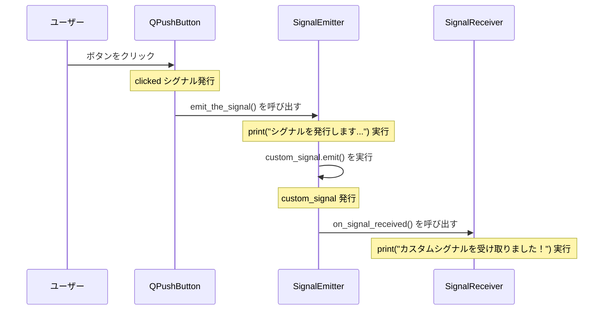

今回は、PySide6を使って、シグナル/スロットメカニズムを学んでいきます。
Pyside6はpythonで簡単にGUIアプリケーションを作成できるパッケージです。
もともとはC++だったみたいなのですが、いつの間にかpythonでも使えていた、ということみたいです。
シグナル/スロットメカニズムはボタンなどのユーザーが起こしたアクションを起点に内部で処理を行う仕組みなのですが、なんとも回りくどいような気がしたので整理してみることにしました。


### コード全体像
今回は、以下のようなコードを使います。
```python
import sys
from PySide6.QtCore import QObject, Signal, Slot
from PySide6.QtWidgets import QApplication, QWidget, QPushButton, QVBoxLayout

# 1. シグナルを定義するクラス (QObjectを継承する必要があります)
class SignalEmitter(QObject):
    # 引数なしのカスタムシグナルを定義
    custom_signal = Signal()

    def __init__(self):
        super().__init__()

    # (ステップ2) ボタンクリックによってこのメソッドが呼び出される
    def emit_the_signal(self):
        print("シグナルを発行します...") # (ステップ2-1) このメッセージが出力される
        # (ステップ2-2) ここでカスタムシグナルを発行
        #              -> このシグナルに接続されているスロット (on_signal_received) が呼び出される
        self.custom_signal.emit()

# 2. スロット（シグナルを受け取るメソッド）を持つクラス
class SignalReceiver(QWidget):
    def __init__(self):
        super().__init__()
        self.emitter = SignalEmitter() # シグナルを発行するオブジェクト
        self.init_ui()

        # 3. シグナルとスロットの接続 (準備段階)
        #    `emitter` オブジェクトの `custom_signal` が発行されたら、
        #    `self` (SignalReceiverオブジェクト) の `on_signal_received` メソッドを呼び出す、という設定。
        #    この接続は emit() される前に確立されている必要がある。
        self.emitter.custom_signal.connect(self.on_signal_received)

    def init_ui(self):
        self.setWindowTitle("PySide6 Minimal Signal Example")
        layout = QVBoxLayout(self)
        button = QPushButton("シグナルを発行", self)

        # (ステップ1) ボタンがクリックされると、接続されたメソッド (emit_the_signal) を呼び出す
        #            これが一連の処理の起点。
        #            QPushButton の 'clicked' シグナルが発行され、
        #            それに接続された 'self.emitter.emit_the_signal' が実行される。
        button.clicked.connect(self.emitter.emit_the_signal)

        layout.addWidget(button)
        self.setLayout(layout)

    # 4. スロットとなるメソッド
    #    (ステップ3) `custom_signal` が emit() された結果、このメソッドが呼び出される
    @Slot()
    def on_signal_received(self):
        # (ステップ3-1) このメッセージが出力される
        print("カスタムシグナルを受け取りました！")

# アプリケーションの実行
if __name__ == '__main__':
    app = QApplication(sys.argv)
    receiver_widget = SignalReceiver()
    receiver_widget.show()
    sys.exit(app.exec())
```

### 挙動
コードを実行すると以下のようなウィンドウが出現します。

`シグナルを発行`ボタンを押すと、以下のようなコメントがコンソールに現れました。
```bash
> py main.py
シグナルを発行します...
カスタムシグナルを受け取りました！
```

### ユーザーがクリックしたあとの流れ
コードのコメントだけでも十分に流れは終えるのですが、一旦図にしてみましょう。


これは、イベントの発生（ユーザーのクリック）からシグナルとスロットを経由して処理が連携していく流れです。

1.  **ユーザー** が **QPushButton** (ボタン) をクリックします。
2.  ボタンは内部的に `clicked` シグナルを発行。`clicked`に接続されている `emit_the_signal()` メソッドを呼び出します（**SignalEmitter** (Emitter)）。
3.  `emit_the_signal()`で、 `print`(コンソールへの出力:"シグナルを発行します...") が実行されます。
4.  `emit_the_signal()` で `custom_signal.emit()` が実行され、カスタムシグナルが発行されます。
5.  `custom_signal` に接続されている `on_signal_received()` メソッド（スロット）が呼び出されます（**SignalReceiver** (Receiver)）。
6.  `on_signal_received()` で、`print`(コンソールへの出力:"カスタムシグナルを受け取りました！") が実行されます。

たしかに、ボタンを押すと`on_signal_recieved`が呼び出されました。
しかし、emit_the_signal メソッドから直接 `on_signal_received` メソッド（あるいはそれに相当する関数）を呼び出せば、`emit()` や `connect()` の記述が不要になり、コードが短くなるように思えます。

### わざわざシグナル/スロットを使う理由

それは、コンポーネント間の **疎結合（Loose Coupling）** を実現するためです。疎結合というのは、システム間の依存関係を小さくすることです。これがシグナル/スロットメカニズムの最も重要な利点です。

#### 問題点:もし直接呼び出しをしていたら？（密結合）

1.  **依存関係の発生:** 上記の直接呼び出しの例では、`SignalEmitter` クラスは `SignalReceiver` クラス（とその `on_signal_received` メソッド）の存在を**知っている必要**があります。`Emitter` を作る際に `Receiver` のインスタンスを渡すなど、両者が直接的に結びついてしまいます。これは**密結合**です。
2.  **再利用性の低下:** `Emitter` を別の場所で再利用したい場合、必ず `Receiver`（または同じインターフェースを持つ別のクラス）も一緒に必要になるか、`Emitter` 側のコードを修正する必要が出てきます。`Emitter` 単体での再利用が難しくなります。
3.  **保守性の低下:** もし `Receiver` のメソッド名 (`on_signal_received`) を変更した場合、`Emitter` 側の呼び出しコードもすべて修正しなければなりません。
4.  **拡張性の低下:** 「ボタンがクリックされたら、`Receiver` 以外にも別の処理（例: ログ出力クラスのメソッド呼び出し）も追加したい」となった場合、`Emitter` の `emit_the_signal` メソッドを**修正**して、新しいクラスのメソッド呼び出しを追加する必要があります。処理が増えるたびに `Emitter` のコードが複雑化していきます。

#### 解決:シグナル/スロットによって役割を分担する（疎結合）

1.  **依存関係の分離:**
    * （発信側）`Emitter` は「特定のイベントが発生した」というシグナルを発行する**だけ**です。誰がそのシグナルを受け取るか、受け取った後で何をするかについて、`Emitter` は**一切関知しません**。<--これは便利なのですが、異なるUIで同じ挙動を起こしたいときに、同じrecieverと接続すると2回実行されてしまうことがあるんですよね。そのため、一度シグナルを受け取ったらブロックする必要があったりもします。
    * 
    * （受信側）`Receiver` は「特定のシグナルが来たら、この処理を実行する」と宣言（接続）する**だけ**です。そのシグナルがどこから、どんなきっかけで発行されたかについて、`Receiver` は**関知しません**（知る必要がありません）。
2.  **再利用性の向上:** `Emitter` も `Receiver` も、それぞれ独立したコンポーネントとして、他の様々な部品と自由に組み合わせることができます。これが大きいですね。
3.  **保守性の向上:** `Receiver` の内部実装やメソッド名が変わっても、シグナル名と接続が変わらなければ `Emitter` に影響はありません。逆も同様です。保守性は実務の経験が乏しいのでなんとも言えませ。あんまり恩恵を感じられませんがこれからわかるかもしれません。
4.  **拡張性の向上:** ボタンクリック時に新しい処理を追加したければ、新しいクラス（スロットを持つ）を作成し、`Emitter` のシグナルに `connect()` するだけで済みます。`Emitter` のコードを**一切変更する必要がありません**。
5.  **多対多の接続:**
    * 1つのシグナルに複数のスロットを接続できます（例：ボタンクリックで、ログ出力と表示更新の両方を行う）。
    * 複数の異なるシグナルを1つのスロットに接続することもできます（例：OKボタンクリックでも、Enterキー押下でも、同じ処理を実行する）。
    直接呼び出しでこれを実現しようとすると、条件分岐が多くなりコードが複雑になります。
6.  **スレッド間通信:** Qt/PySideのシグナル/スロットは、異なるスレッド間で安全にデータをやり取りする仕組み（Queued Connection）も提供しています。直接メソッドを呼び出す方法では、スレッドセーフティを自分で慎重に管理する必要があり、非常に複雑でバグが発生しやすくなります。

### 結論

`emit()` や `connect()` を書く手間は、コンポーネント間の**疎結合**という大きなメリットを得るためのトレードオフです。

提示されたような非常にシンプルな例では、直接呼び出しでも問題ないように見えるかもしれません。しかし、アプリケーションが少しでも複雑になり、多くのコンポーネントが連携するようになると、シグナル/スロットによる疎結合の恩恵（**再利用性**、**保守性**、**拡張性**、**スレッド安全性**）が非常に大きくなります。これが、Qt/PySide のようなフレームワークでシグナル/スロットが中心的な役割を果たしている理由です。